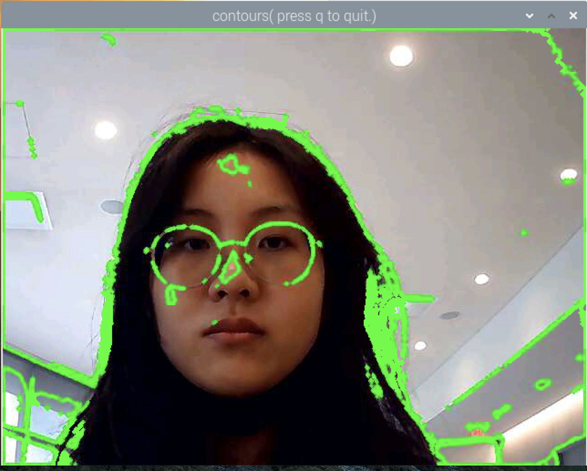
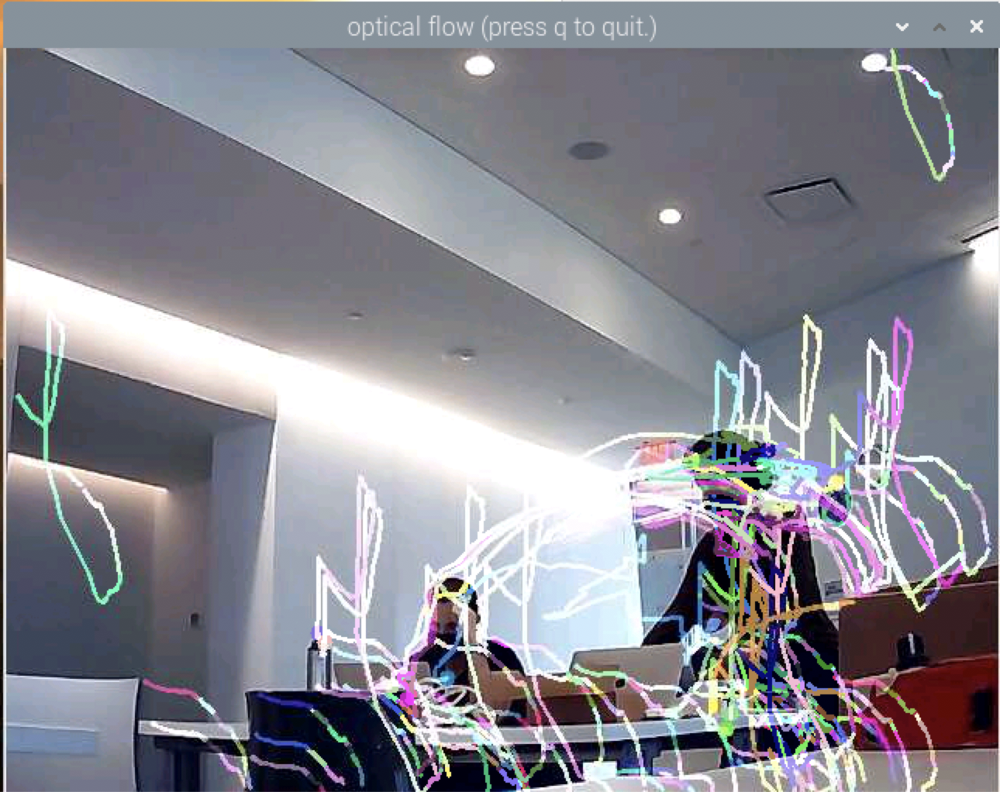
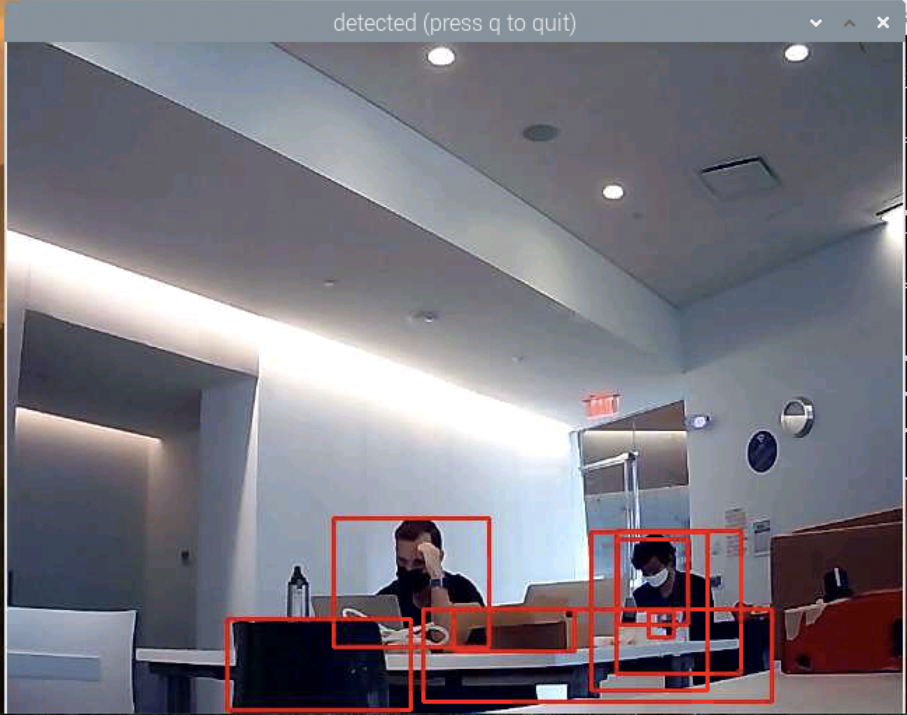
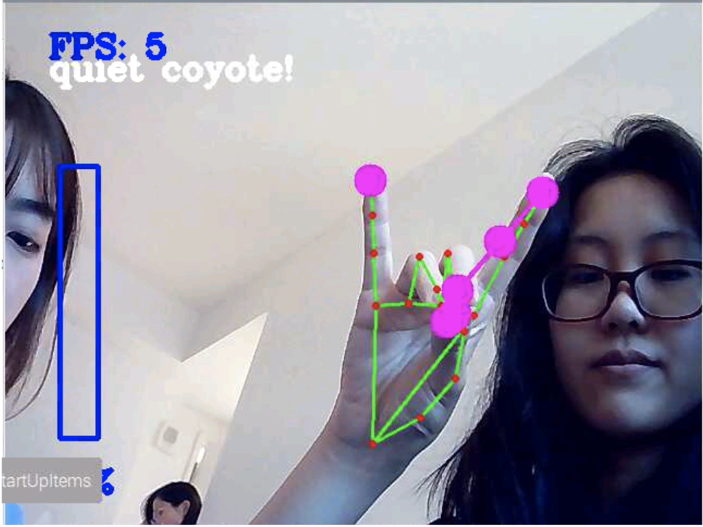
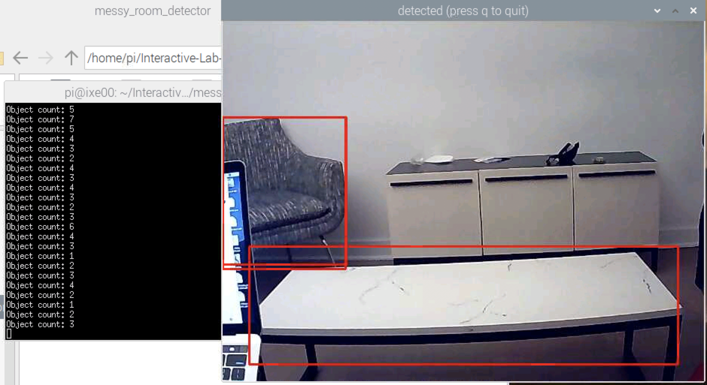
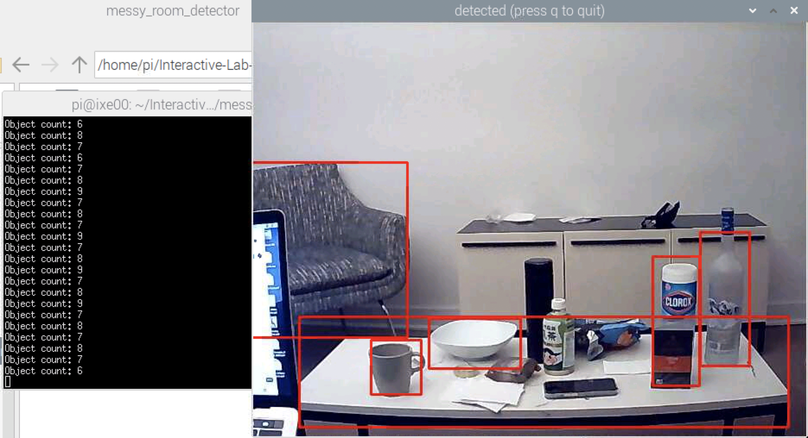
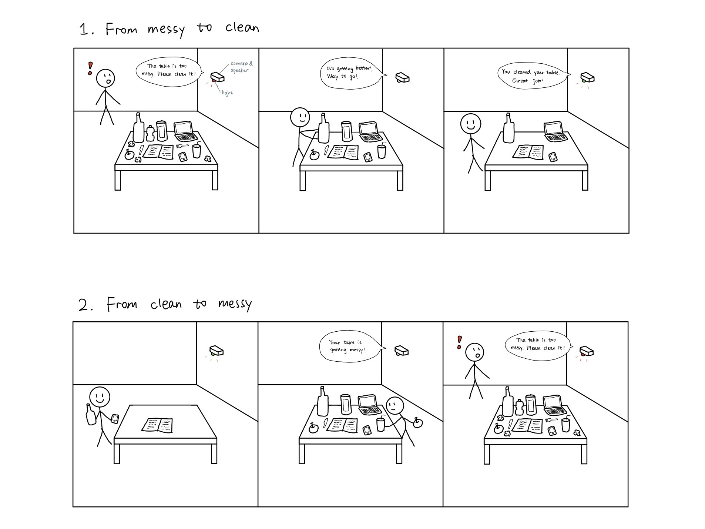

# Observant Systems

Collaboration with Hongyu Shen, Ruby Pan, Zhenghe Wang


For lab this week, we focus on creating interactive systems that can detect and respond to events or stimuli in the environment of the Pi, like the Boat Detector we mentioned in lecture. 
Your **observant device** could, for example, count items, find objects, recognize an event or continuously monitor a room.

This lab will help you think through the design of observant systems, particularly corner cases that the algorithms needs to be aware of.

## Prep

1.  Pull the new Github Repo.
2.  Install VNC on your laptop if you have not yet done so. This lab will actually require you to run script on your Pi through VNC so that you can see the video stream. Please refer to the [prep for Lab 2](https://github.com/FAR-Lab/Interactive-Lab-Hub/blob/Fall2021/Lab%202/prep.md), we offered the instruction at the bottom.
3.  Read about [OpenCV](https://opencv.org/about/), [MediaPipe](https://mediapipe.dev/), and [TeachableMachines](https://teachablemachine.withgoogle.com/).
4.  Read Belloti, et al.'s [Making Sense of Sensing Systems: Five Questions for Designers and Researchers](https://www.cc.gatech.edu/~keith/pubs/chi2002-sensing.pdf).

### For the lab, you will need:

1. Raspberry Pi
1. Webcam 
1. Microphone (if you want to have speech or sound input for your design)

### Deliverables for this lab are:
1. Show pictures, videos of the "sense-making" algorithms you tried.
1. Show a video of how you embed one of these algorithms into your observant system.
1. Test, characterize your interactive device. Show faults in the detection and how the system handled it.

## Overview
Building upon the paper-airplane metaphor (we're understanding the material of machine learning for design), here are the four sections of the lab activity:

A) [Play](#part-a)

B) [Fold](#part-b)

C) [Flight test](#part-c)

D) [Reflect](#part-d)

---

### Part A
### Play with different sense-making algorithms.

#### OpenCV
A more traditional method to extract information out of images is provided with OpenCV. The RPI image provided to you comes with an optimized installation that can be accessed through python. We included 4 standard OpenCV examples: contour(blob) detection, face detection with the ``Haarcascade``, flow detection (a type of keypoint tracking), and standard object detection with the [Yolo](https://pjreddie.com/darknet/yolo/) darknet.

Most examples can be run with a screen (e.g. VNC or ssh -X or with an HDMI monitor), or with just the terminal. The examples are separated out into different folders. Each folder contains a ```HowToUse.md``` file, which explains how to run the python example. 

Following is a nicer way you can run and see the flow of the `openCV-examples` we have included in your Pi. Instead of `ls`, the command we will be using here is `tree`. [Tree](http://mama.indstate.edu/users/ice/tree/) is a recursive directory colored listing command that produces a depth indented listing of files. Install `tree` first and `cd` to the `openCV-examples` folder and run the command:

```shell
pi@ixe00:~ $ sudo apt install tree
...
pi@ixe00:~ $ cd openCV-examples
pi@ixe00:~/openCV-examples $ tree -l
.
├── contours-detection
│   ├── contours.py
│   └── HowToUse.md
├── data
│   ├── slow_traffic_small.mp4
│   └── test.jpg
├── face-detection
│   ├── face-detection.py
│   ├── faces_detected.jpg
│   ├── haarcascade_eye_tree_eyeglasses.xml
│   ├── haarcascade_eye.xml
│   ├── haarcascade_frontalface_alt.xml
│   ├── haarcascade_frontalface_default.xml
│   └── HowToUse.md
├── flow-detection
│   ├── flow.png
│   ├── HowToUse.md
│   └── optical_flow.py
└── object-detection
    ├── detected_out.jpg
    ├── detect.py
    ├── frozen_inference_graph.pb
    ├── HowToUse.md
    └── ssd_mobilenet_v2_coco_2018_03_29.pbtxt
```

The flow detection might seem random, but consider [this recent research](https://cseweb.ucsd.edu/~lriek/papers/taylor-icra-2021.pdf) that uses optical flow to determine busy-ness in hospital settings to facilitate robot navigation. Note the velocity parameter on page 3 and the mentions of optical flow.

Now, connect your webcam to your Pi and use **VNC to access to your Pi** and open the terminal. Use the following command lines to try each of the examples we provided:
(***it will not work if you use ssh from your laptop***)

```
pi@ixe00:~$ cd ~/openCV-examples/contours-detection
pi@ixe00:~/openCV-examples/contours-detection $ python contours.py
...
pi@ixe00:~$ cd ~/openCV-examples/face-detection
pi@ixe00:~/openCV-examples/face-detection $ python face-detection.py
...
pi@ixe00:~$ cd ~/openCV-examples/flow-detection
pi@ixe00:~/openCV-examples/flow-detection $ python optical_flow.py 0 window
...
pi@ixe00:~$ cd ~/openCV-examples/object-detection
pi@ixe00:~/openCV-examples/object-detection $ python detect.py
```

**\*\*\*Try each of the following four examples in the `openCV-examples`, include screenshots of your use and write about one design for each example that might work based on the individual benefits to each algorithm.\*\*\***

### Contours



Contours detection could be used in an image processing app for artists. Lines and contours detected by the system could be processed into different paint textures or brushes, hence auto generating art pieces for digital artists. 

### Face detection


Face detection could be integrated into an automatic camera for taking group photos. When everyone’s smiling, the camera takes a picture; when someone is not smiling, it gives an alarm.

### Flow detection



Flow detection could be used in athletic training. During training for throwing sports such as javelin, discus, hammer and shot, the system can track the object thrown by athletes and draw the curve. Coaches and athletes themselves can directly observe their performances and adjust strength and angles of throws based on the curves.

### Object detection



Object detection could be used to remind people to clean rooms. If there are too many objects on the table/on the floor, the system gives an alarm to tell users that their rooms are messy. Users can also adjust the level of “messy” based on their current room setups. 

#### MediaPipe

A more recent open source and efficient method of extracting information from video streams comes out of Google's [MediaPipe](https://mediapipe.dev/), which offers state of the art face, face mesh, hand pose, and body pose detection.


To get started, create a new virtual environment with special indication this time:

```
pi@ixe00:~ $ virtualenv mpipe --system-site-packages
pi@ixe00:~ $ source mpipe/bin/activate
(mpipe) pi@ixe00:~ $ 
```

and install the following.

```
...
(mpipe) pi@ixe00:~ $ sudo apt install ffmpeg python3-opencv
(mpipe) pi@ixe00:~ $ sudo apt install libxcb-shm0 libcdio-paranoia-dev libsdl2-2.0-0 libxv1  libtheora0 libva-drm2 libva-x11-2 libvdpau1 libharfbuzz0b libbluray2 libatlas-base-dev libhdf5-103 libgtk-3-0 libdc1394-22 libopenexr23
(mpipe) pi@ixe00:~ $ pip3 install mediapipe-rpi4 pyalsaaudio
```

Each of the installs will take a while, please be patient. After successfully installing mediapipe, connect your webcam to your Pi and use **VNC to access to your Pi**, open the terminal, and go to Lab 5 folder and run the hand pose detection script we provide:
(***it will not work if you use ssh from your laptop***)


```
(mpipe) pi@ixe00:~ $ cd Interactive-Lab-Hub/Lab\ 5
(mpipe) pi@ixe00:~ Interactive-Lab-Hub/Lab 5 $ python hand_pose.py
```

Try the two main features of this script: 1) pinching for percentage control, and 2) "[Quiet Coyote](https://www.youtube.com/watch?v=qsKlNVpY7zg)" for instant percentage setting. Notice how this example uses hardcoded positions and relates those positions with a desired set of events, in `hand_pose.py` lines 48-53. 

**\*\*\*Consider how you might use this position based approach to create an interaction, and write how you might use it on either face, hand or body pose tracking.\*\*\***

(You might also consider how this notion of percentage control with hand tracking might be used in some of the physical UI you may have experimented with in the last lab, for instance in controlling a servo or rotary encoder.)




Hand pose tracking could be used to implement a translator for sign language. This device consists of a camera, a speaker, and a processor for translation. It could be clipped onto the user’s collars so that the camera could detect hand motion in front of the user’s chest. The camera captures hand motion, the processor translates it into text, then the speaker reads the translated text out loud. This way, people with congenital deafness can communicate with others smoothly.


#### Teachable Machines
Google's [TeachableMachines](https://teachablemachine.withgoogle.com/train) might look very simple. However, its simplicity is very useful for experimenting with the capabilities of this technology.


To get started, create and activate a new virtual environment for this exercise with special indication:

```
pi@ixe00:~ $ virtualenv tmachine --system-site-packages
pi@ixe00:~ $ source tmachine/bin/activate
(tmachine) pi@ixe00:~ $ 
```

After activating the virtual environment, install the requisite TensorFlow libraries by running the following lines:
```
(tmachine) pi@ixe00:~ $ cd Interactive-Lab-Hub/Lab\ 5
(tmachine) pi@ixe00:~ Interactive-Lab-Hub/Lab 5 $ sudo chmod +x ./teachable_machines.sh
(tmachine) pi@ixe00:~ Interactive-Lab-Hub/Lab 5 $ ./teachable_machines.sh
``` 

This might take a while to get fully installed. After installation, connect your webcam to your Pi and use **VNC to access to your Pi**, open the terminal, and go to Lab 5 folder and run the example script:
(***it will not work if you use ssh from your laptop***)

```
(tmachine) pi@ixe00:~ Interactive-Lab-Hub/Lab 5 $ python tm_ppe_detection.py
```


(**Optionally**: You can train your own model, too. First, visit [TeachableMachines](https://teachablemachine.withgoogle.com/train), select Image Project and Standard model. Second, use the webcam on your computer to train a model. For each class try to have over 50 samples, and consider adding a background class where you have nothing in view so the model is trained to know that this is the background. Then create classes based on what you want the model to classify. Lastly, preview and iterate, or export your model as a 'Tensorflow' model, and select 'Keras'. You will find an '.h5' file and a 'labels.txt' file. These are included in this labs 'teachable_machines' folder, to make the PPE model you used earlier. You can make your own folder or replace these to make your own classifier.)

**\*\*\*Whether you make your own model or not, include screenshots of your use of Teachable Machines, and write how you might use this to create your own classifier. Include what different affordances this method brings, compared to the OpenCV or MediaPipe options.\*\*\***


*Don't forget to run ```deactivate``` to end the Teachable Machines demo, and to reactivate with ```source tmachine/bin/activate``` when you want to use it again.*


For the Teachable Machines, we tried to use this to detect a certain speaker’s words in a noisy room when there are other people talking. We intentionally recorded background sounds with noises and other people’s voices, and it turned out that Teachable Machine could tell the speaker from others from the training. We could possibly use it for class participation documentation. With the system having each student’s voice recorded in the sample set, it can tell how much each student is contributing to the group discussions. 


#### Filtering, FFTs, and Time Series data. (optional)
Additional filtering and analysis can be done on the sensors that were provided in the kit. For example, running a Fast Fourier Transform over the IMU data stream could create a simple activity classifier between walking, running, and standing.

Using the accelerometer, try the following:

**1. Set up threshold detection** Can you identify when a signal goes above certain fixed values?

**2. Set up averaging** Can you average your signal in N-sample blocks? N-sample running average?

**3. Set up peak detection** Can you identify when your signal reaches a peak and then goes down?

**\*\*\*Include links to your code here, and put the code for these in your repo--they will come in handy later.\*\*\***


### Part B
### Construct a simple interaction.

Pick one of the models you have tried, pick a class of objects, and experiment with prototyping an interaction.
This can be as simple as the boat detector earlier.
Try out different interaction outputs and inputs.

**\*\*\*Describe and detail the interaction, as well as your experimentation here.\*\*\***

Our device is a messy table detector. When there are too many items on a table, the device will be triggered and tell the user that he/she needs to clean the table. We plan to use the object detector model and modify the code to output the number of objects detected. Once this number is above a threshold, the device will say something like “Clean the table please! It’s too messy!” 

We placed the camera on top of the couch so that it can see the whole table. We want to try out two different inputs: one with many different items on the table and one with no objects. Some objects we used in the interaction are common objects such as the laptop, cups, bottles, And we coded the system to show the number of objects it detected.




### Part C
### Test the interaction prototype

Now flight test your interactive prototype and **note down your observations**:
For example:
1. When does it what it is supposed to do?

The system is supposed to detect objects on the table and display the amount of objects. It does detect the objects when the camera is stable and when the objects placed on the table have clear shapes and colors.

2. When does it fail?

The system fails when 1) the camera captures objects that are not on the table, so the detected number of objects exceeds the actual number; 2) the objects don’t have clear shapes and colors, so these kinds of objects are not successfully detected.

3. When it fails, why does it fail?

First off, stability is a crucial factor that decides whether the system can detect the objects. When the camera is not stabilized, it takes longer to detect the objects and would fail to do so sometimes. Secondly, we found that placing the camera from different angles sometimes led to different results. Also, the lighting and colors of the objects can influence if the system successfully detects the objects.

4. Based on the behavior you have seen, what other scenarios could cause problems?

Besides the shapes and colors of the object itself, the contrast between the object and the surrounding would affect whether it can be detected. In addition, the way of putting several objects together would change the number of objects being detected. For example, if two objects are stacked up and they overlap each other, the system would perceive them as a single object.

**\*\*\*Think about someone using the system. Describe how you think this will work.\*\*\***
1. Are they aware of the uncertainties in the system?

Since our device is designed to detect how messy the table is, users might not be fully aware of the uncertainties in the system unless specifically marked. People often place objects on top of each other to save space. For example, they might put a water bottle on top of a stack of books. For people whose table is messier, they might also put random objects like paper towels on the table while being unaware that the system might not detect it. 

2. How bad would they be impacted by a miss classification?

If there are many objects on the table but the system fails to detect them, for example, tissues, then users would not know that they need to clean the room and leave the room messy. Another scenario is that when there is nothing on the table but the system detects it as messy. For example, the camera is not at the right angle and includes too many objects in the background. Users would be annoyed by the repetitive sound from the system that tells them to clean the table.

3. How could change your interactive system to address this?

To address the issue that the system might count multiple objects stacked on top of each other as a single object, we could instead use the sum of areas of the objects (areas of red rectangles) instead of object count as the messiness indicator. One concern is to differentiate between objects on the table and the table itself. If the system regards the table as a big object placed onto the table, even if it is clean, it will still regard it as messy.

4. Are there optimizations you can try to do on your sense-making algorithm.

To address the issue that objects are harder to detect when it has low contrast with the color of the table, we could change the “score” threshold in code that determines if something is an object. The current threshold is 0.2. We could plan around with this score and find the optimal one.


### Part D
### Characterize your own Observant system

Now that you have experimented with one or more of these sense-making systems **characterize their behavior**.
During the lecture, we mentioned questions to help characterize a material:
* What can you use X for?

For object detection systems, we might use it for detecting if the room is clean and organized on a smaller scale. On a larger scale, we might utilize it for warehouse management. Object detections can make sure that the inventory is fully organized. For warehouses with fragile inventory, tidiness is one of the most important factors in order to protect the boxes.

* What is a good environment for X?

A good environment would have good lighting which can present each object clearly in the camera, and there should be enough contrast between each object as well as between objects and the background. There should also be some space between each object, so the objects are separated and can be detected individually.

* What is a bad environment for X?

A bad environment might be rooms without much lighting. This might cause the system to fail in detecting certain objects from the background. Other factors like depth of the room and colors of the objects are also influential. Rooms with too much depth might make objects look small and undetectable. Places where the colors of objects are similar is also a bad environment. 

* When will X break? When it breaks how will X break?

It will break when there is too much motion of the camera because the delay is quite bad.

* What are other properties/behaviors of X?

When the user cleans his/her messy table, we could make the device detect this change of number of objects and say something encouraging like “You cleaned your table. Well done! Keep it up!”

* How does X feel?

X feels sad when the table is messy. (What does this question mean??)

**\*\*\*Include a short video demonstrating the answers to these questions.\*\*\***

[Short demo](https://drive.google.com/file/d/1ALbHnESNznT5g1rTDnVWOlv-pep1afxT/view?usp=sharing)

When the number of objects exceeds a certain limit, the warining will be triggered. We have not implemented the text-to-speech audio alert in this video, but the warning was printed out in the console.

### Part 2.

Following exploration and reflection from Part 1, finish building your interactive system, and demonstrate it in use with a video.

**\*\*\*Include a short video demonstrating the finished result.\*\*\***

For part 2, we wish to improve the messy room detector system by adding both voice and lighting feedback. Both the voice and lighting feedback are designed to enhance convenience and promote user accessibility. When the system finds the designated area “messy” according to the user’s personalized standard, our system will speak out loud and tell the user to clean up the area. The light works simultaneously with a similar functionality. When the area is detected as “messy”, the red light will flash. With these two add-on functions, users won’t have to walk to the screen and stare at it to figure out if the area is messy. Users with disabilities can also easily get feedback from the detector through either voice or lighting. 

For future updates, we hope the system can interact with the user through voice command. For example, the user can ask the system: “is my room messy?” or ask the system to change the color or ambience of the light in the room. 


#### Storyboard


#### Demo

[Demo video](https://drive.google.com/file/d/17KsD2CheAvnc8jD_lYvpnaWKuil_R6ux/view?usp=sharing)